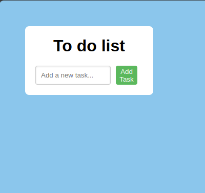

# 🗒️ To-Do List App | TODOリストアプリ



## Overview | 概要
A simple to-do list app that helps users manage tasks. Users can add, delete, and check off tasks.  
タスク管理のためのシンプルな TODOリストアプリです。ユーザーはタスクの追加、削除、完了済みのチェックができます。

## ✨ Features | 機能
- ➕ Add new tasks | 新しいタスクを追加
- 🗑️ Delete tasks | タスクを削除
- ✔️ Mark tasks as completed | タスクを完了としてマーク

## 🛠 Installation | インストール方法
1. Clone the repository:  
   リポジトリをクローンします：
   ```bash
   git clone https://github.com/Vuinguyen08/to-do-list.git
   
